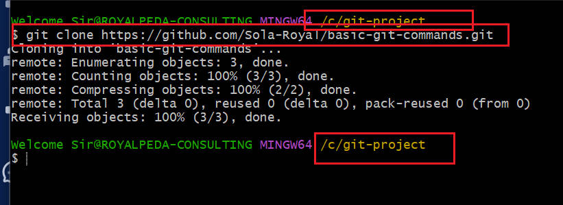

># **basic-git-commands**

The basic Git commands project

>**the project is about Git setup and implementation of these commands like `git checkout -b`, `git add`, `git commit`, `git push`, and `git merge` are executed directly in the terminal with efective hands on project**

----
>## **Part 1: Setup amd Initial configuration**

_Git installled, github acount signed up, created github account and github repository created_

-----
>## **Github repository**
_repository named and descrption inputed_

>## **Clone repository**
_clone remote repository from github account into git local repository_

>## **Git Workflow**
_Create an empty file, add content, and add it to git_

>##  **Commit Changes and push**

_perform `git commit -m "This is my first commit"`,`git push origin main`and push it to remote repository_

># **Part 2: Simulating Tom and Jerry's Work**
----
>## Create branch Navigation page
_create update-navigation branch and checkout then add content to the `index.html` file. `git add` and stage the information_

>##  **Commit update-navigation changes**
_perform `git commit -m "Update navigation bar"`,`git push origin update-navigation`and pull from remote repository_

>## Create branch contact info page and push
_create add-contact-info branch and checkout then add content to the `index.html` file. `git add` and commit the information, then push to the remote repository_

------
>**the journey of version controla and collaboration was performed with hand on project in this work**